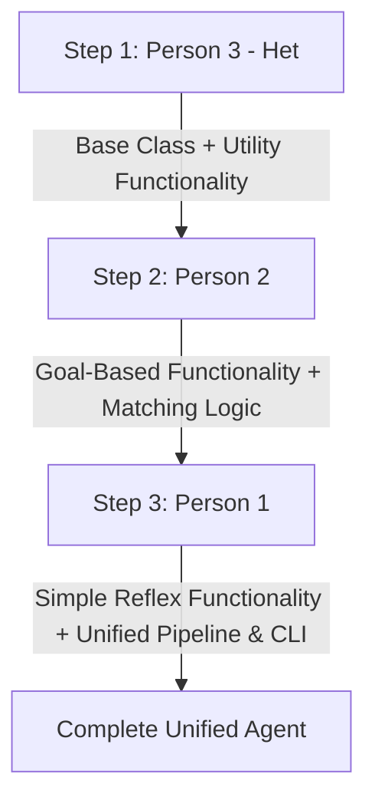

# 🌊 Implementation Flow & Contribution Guide

> **Project:** Unified Smart Hostel / Airbnb Management Agent  
> **Team Architecture:** 1 Agent with 3 Core Functionalities (Utility-Based, Goal-Based, Simple Reflex)  
> **Order of Execution:** **Person 3 (First)** ➔ **Person 2 (Second)** ➔ **Person 1 (Third)**

---

## 📌 Overview of the Unified Agent

Instead of building 3 isolated agent programs, the team is building **one unified Intelligent Agent (`SmartHostelAgent`)** that contains **three distinct functional decision engines**:

```text
┌────────────────────────────────────────────────────────────────────────┐
│               UNIFIED SMART HOSTEL MANAGEMENT AGENT                    │
├────────────────────────┬───────────────────────┬───────────────────────┤
│    FUNCTIONALITY 1     │    FUNCTIONALITY 2    │    FUNCTIONALITY 3    │
│  Room Behavior Monitor │  Roommate Compatibility│     Room Selection    │
├────────────────────────┼───────────────────────┼───────────────────────┤
│     Simple Reflex      │      Goal-Based       │     Utility-Based     │
│   (Condition-Action)   │   (Goal Satisfaction) │   (Weighted Scoring)  │
├────────────────────────┼───────────────────────┼───────────────────────┤
│ Person 1 (3rd commit)  │ Person 2 (2nd commit) │ Person 3 (1st commit) │
└────────────────────────┴───────────────────────┴───────────────────────┘
```

---

## 🚀 Step-by-Step Contribution Order



---

## 👤 STEP 1: Person 3 (You) — First Changes

### 🎯 Role & Responsibility
- **Paradigm:** **Utility-Based Agent Functionality**
- **Objective:** Create the main agent class foundation and implement the **Room Selection & Multi-Attribute Utility Scoring Functionality**.
- **Why First?** Person 3 establishes the base class structure and the room evaluation system, which consumes scores from the other modules.

### 📝 Exact Changes Person 3 Must Make:
1. **Create `smart_hostel_agent.py`** with the base `SmartHostelAgent` class.
2. Define the sample dataset structures:
   - `available_rooms` (list of dictionaries containing rent, distance, facilities, noise level, and base compatibility).
   - Default utility weights configuration (affordability: 0.25, distance: 0.15, facilities: 0.20, noise: 0.15, compatibility: 0.25).
3. Implement the utility calculation methods:
   - `normalize_attributes(room)`: Normalizes rent (lower is better), distance (closer is better), facilities (higher is better), noise (low=100, medium=50, high=0), and compatibility (percentage).
   - `calculate_room_utility(room, weights)`: Computes the overall weighted score (0 to 100).
   - `recommend_best_room(rooms, custom_weights=None)`: Evaluates all available rooms, ranks them, and selects the maximum utility room.
4. Add placeholder stub methods with `pass` / `NotImplementedError` for Person 2 (`match_roommate_goal`) and Person 1 (`monitor_room_conditions`).
5. Add a standalone test block at the bottom (`if __name__ == "__main__":`) demonstrating Person 3's utility engine working independently.

### 💻 Code Signature to Implement:
```python
class SmartHostelAgent:
    def __init__(self, name="SmartHostel-UnifiedAgent"):
        self.name = name
        self.weights = {
            "affordability": 0.25,
            "distance": 0.15,
            "facilities": 0.20,
            "noise": 0.15,
            "compatibility": 0.25
        }

    # ==========================================
    # FUNCTIONALITY 3: Utility-Based Room Selection
    # Implemented by: Person 3
    # ==========================================
    def normalize_room_data(self, room):
        """Converts raw room metrics to a standardized 0-100 scale."""
        # Normalize rent, distance, facilities, noise, compatibility
        ...

    def evaluate_room_utility(self, room, weights=None):
        """Calculates utility score U(s) based on multi-attribute weights."""
        ...

    def select_optimal_room(self, rooms, weights=None):
        """Returns the room with the highest utility score."""
        ...
```

### ✅ Expected Git Commit:
```bash
git add smart_hostel_agent.py
git commit -m "feat(person3): initialize agent skeleton and implement utility-based room selection"
```

---

## 👥 STEP 2: Person 2 — Second Changes

### 🎯 Role & Responsibility
- **Paradigm:** **Goal-Based Agent Functionality**
- **Objective:** Implement the **Roommate Compatibility & Goal Satisfaction Engine** inside `SmartHostelAgent`.
- **Integration:** Allows user lifestyle preferences to evaluate candidate roommates and verifies if a compatibility goal threshold (e.g., `>= 70%`) is satisfied. Person 2 can also feed this compatibility score into Person 3's room utility function.

### 📝 Exact Changes Person 2 Must Make:
1. Open `smart_hostel_agent.py` created by Person 3.
2. Define candidate roommate profiles:
   - Lifestyle traits: `sleep_schedule` (Early/Late), `cleanliness` (High/Med/Low), `noise_tolerance` (Low/Med/High), `smoking` (No/Yes), `study_habits` (Quiet/Group).
3. Implement the goal-based methods in `SmartHostelAgent`:
   - `calculate_compatibility_score(user_pref, candidate_pref)`: Computes percentage match across lifestyle dimensions.
   - `evaluate_roommate_goal(candidates, user_pref, goal_threshold=70)`: Iterates through candidates, evaluates goal satisfaction (`score >= goal_threshold`), filters eligible matches, and recommends the best matching roommate.
4. Update the test block in `if __name__ == "__main__":` to test Person 3 + Person 2 functionality in sequence.

### 💻 Code Signature to Implement:
```python
    # ==========================================
    # FUNCTIONALITY 2: Goal-Based Roommate Matching
    # Implemented by: Person 2
    # ==========================================
    def calculate_compatibility(self, user_prefs, candidate_prefs):
        """Calculates matching percentage between user and candidate."""
        ...

    def match_roommate_goal(self, candidates, user_prefs, goal_threshold=70):
        """
        Goal-Based search: checks candidates against goal_threshold.
        Returns status (Goal Achieved / Failed) and recommended candidate.
        """
        ...
```

### ✅ Expected Git Commit:
```bash
git add smart_hostel_agent.py
git commit -m "feat(person2): implement goal-based roommate compatibility and goal check"
```

---

## 👤 STEP 3: Person 1 — Third Changes

### 🎯 Role & Responsibility
- **Paradigm:** **Simple Reflex Agent Functionality**
- **Objective:** Implement the **Real-Time Room Behavior Monitoring & Condition-Action Rules**, plus the **Unified Pipeline & CLI Interface** that runs all 3 functionalities in one unified agent execution.
- **Integration:** Implements the instant reflex sensor-to-actuator rules (noise, door lock, light energy conservation), and binds Functionality 1, 2, and 3 into a complete interactive run flow.

### 📝 Exact Changes Person 1 Must Make:
1. Open `smart_hostel_agent.py` updated by Person 2.
2. Implement the simple reflex condition-action rules:
   - `monitor_room_conditions(percepts)`:
     - `IF noise_level > 60 dB THEN action = "Generate High Noise Warning"`
     - `IF door_locked == False THEN action = "Alert: Door Unlocked - Trigger Auto Lock"`
     - `IF light_status == 'ON' and occupancy == False THEN action = "Action: Turn Off Lights (Energy Saver)"`
     - `IF all conditions normal THEN action = "Status: Room Environment Normal"`
3. Implement the master driver method `run_unified_workflow()` in `SmartHostelAgent`:
   - Step 1: Execute Simple Reflex monitoring on current room percepts.
   - Step 2: Execute Goal-Based roommate matching with user preferences.
   - Step 3: Pass matched roommate compatibility into the Utility-Based room selector to pick the overall best room.
4. Build a clean, interactive CLI menu in `__main__` allowing the user to:
   - Run Full Unified Agent Cycle.
   - Run Individual Functionality (1: Simple Reflex, 2: Goal-Based, 3: Utility-Based).

### 💻 Code Signature to Implement:
```python
    # ==========================================
    # FUNCTIONALITY 1: Simple Reflex Behavior Monitor
    # Implemented by: Person 1
    # ==========================================
    def monitor_room_conditions(self, percepts):
        """
        Simple Reflex Engine: Condition -> Action table lookup without history.
        Evaluates percepts: noise_db, door_locked, light_on, occupied.
        Returns immediate actions/alerts.
        """
        ...

    # ==========================================
    # MASTER AGENT PIPELINE
    # Integrates Person 1, Person 2, and Person 3
    # ==========================================
    def run_unified_agent(self, room_percepts, user_prefs, candidates, rooms):
        """Runs all 3 agent functionalities sequentially in one unified workflow."""
        ...
```

### ✅ Expected Git Commit:
```bash
git add smart_hostel_agent.py
git commit -m "feat(person1): implement simple reflex monitoring and complete unified agent pipeline"
```

---

## 📊 Summary of Agent Functionalities & Ownership

| Step | Contributor | Functionality | Agent Architecture | Decision Strategy | Key Output |
| :--- | :--- | :--- | :--- | :--- | :--- |
| **1st** | **Person 3 (Het)** | Room Selection Engine | **Utility-Based** | Multi-attribute weighted utility calculation $U(s)$ | Best room recommendation with ranked utility scores |
| **2nd** | **Person 2** | Roommate Matching | **Goal-Based** | Goal evaluation ($\text{Score} \ge \text{Threshold}$) | Compatible roommate satisfying the goal |
| **3rd** | **Person 1** | Behavior Monitoring | **Simple Reflex** | Condition $\rightarrow$ Action rule matching | Immediate alerts & environmental control actions |

---

## 🧪 Verification & Final Testing Checklist

Once all 3 steps are complete, execute:
```bash
python smart_hostel_agent.py
```

Expected output should showcase all 3 agent paradigms working inside the single agent:
1. **Simple Reflex:** Immediate warning alerts based on percepts without memory.
2. **Goal-Based:** Candidate matching that explicitly evaluates goal achievement ($\ge 70\%$).
3. **Utility-Based:** Multi-attribute score ranking picking the globally optimal room.
